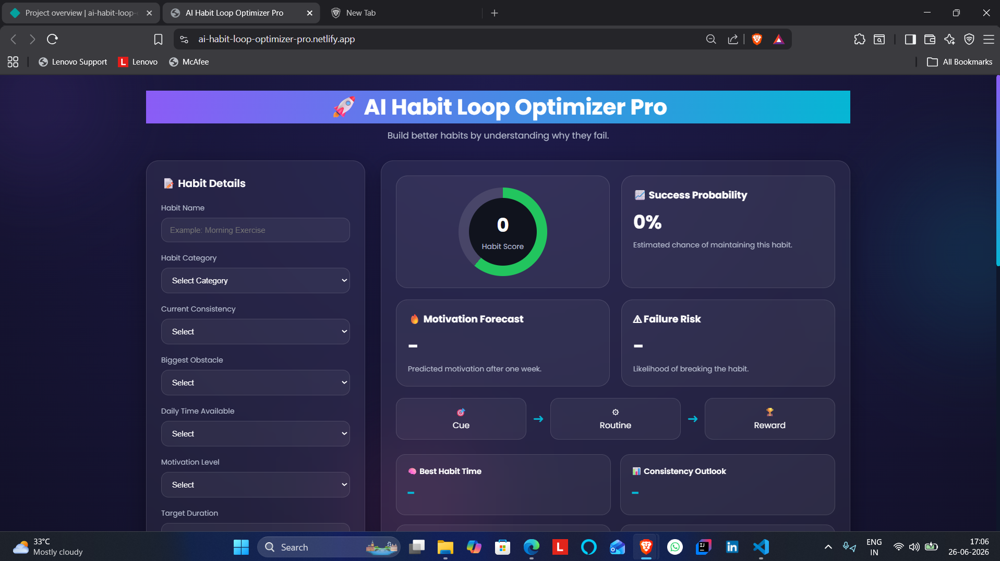
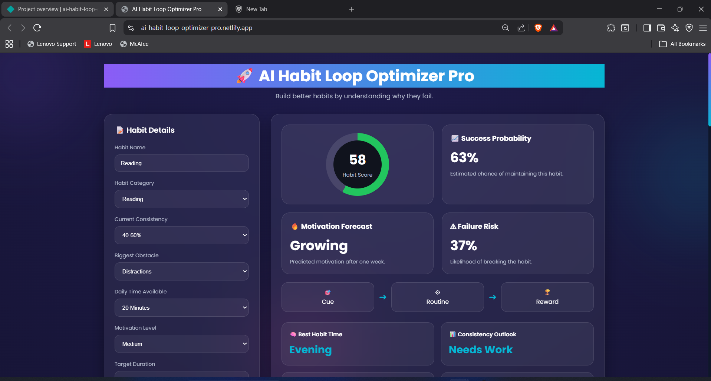
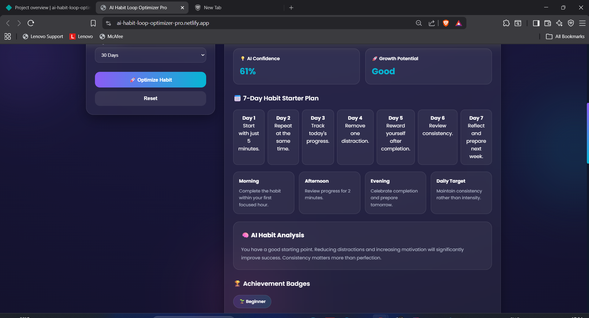

# AI Habit Loop Optimizer Pro

## 🚀 Day 18 of my 30 Days 30 AI Websites Challenge

AI Habit Loop Optimizer Pro is an AI-inspired productivity web application designed to help users build better habits through structured analysis and personalized recommendations.

Instead of simply tracking habits, the platform evaluates consistency, motivation, available time, obstacles, and habit type to estimate the likelihood of long-term success. It then generates AI-powered insights, improvement strategies, a weekly action plan, and a downloadable habit report.

## 🌐 Live Demo

https://ai-habit-loop-optimizer-pro.netlify.app/

## 📸 Screenshots

## ✨ Features

* Habit Success Score
* Success Probability Prediction
* Failure Risk Analysis
* Motivation Forecast
* Growth Potential Evaluation
* AI Confidence Score
* Best Time Recommendation
* Personalized 7-Day Habit Plan
* AI Reasoning Engine
* Achievement Badge System
* Report Generation
* Copy Report Feature
* Download Report Feature
* Fully Responsive Design

## 📋 How It Works

1. Enter your habit details.
2. Select your consistency level.
3. Choose your biggest obstacle.
4. Select available daily time.
5. Choose your motivation level.
6. Set your target duration.
7. Run the AI analysis.
8. Review personalized recommendations and download your report.

## 🛠️ Technologies Used

* HTML
* CSS
* JavaScript
* Built with the help of AI-assisted development tools

## 🎯 Challenge Progress

✅ Day 18 Completed — AI Habit Loop Optimizer Pro

Part of my **30 Days 30 AI Websites Challenge**, where I build and publish one AI-powered web project every day to strengthen my frontend development, product-building, and problem-solving skills.

## 👨‍💻 Author

**Bettam Anand**

B.Tech CSE (Data Science)

JNTUH University College of Engineering Palair
